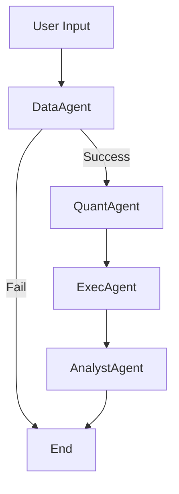

# Natural Language to Quant Platform Design Document

## 1. Project Overview
The **NL-to-Quant Platform** is an AI-powered tool that allows users to perform financial analysis and backtesting using natural language commands. Instead of writing complex Python code manually, users can describe their trading strategies (e.g., "Backtest a generic crossover strategy on 600519.SH"), and the system automates the data fetching, code generation, execution, and result visualization.

## 2. System Architecture

The system follows a **Multi-Agent Architecture** orchestrated by **LangGraph**. It operates as a state machine where a shared state is passed between specialized agents.

### High-Level Workflow


### Core Components
1.  **Frontend (Streamlit):** Handles user chat input and renders interactive Plotly charts.
2.  **Orchestrator (LangGraph):** Manages the flow of control between agents.
3.  **Agents:** Specialized modules for specific tasks (Data, Coding, Execution, Analysis).

## 3. Agent Specifications

### 3.1. Data Agent (`app/agents/data_agent.py`)
*   **Role:** The "Librarian". Fetches historical market data.
*   **Input:** User message, Date range.
*   **Logic:**
    *   Extracts ticker symbols (e.g., `600519.SH`) from the user prompt using an LLM extractor.
    *   Connects to **Tushare Pro API**.
    *   Fetches daily OHLCV data.
    *   Standardizes column names for VectorBT (`Open`, `High`, `Low`, `Close`, `Volume`).
*   **Output:** Updates `market_data` in the shared state.

### 3.2. Quant Agent (`app/agents/quant_agent.py`)
*   **Role:** The "Engineer". Translates natural language into Python code.
*   **Input:** User strategy description, Data schema.
*   **Logic:**
    *   Uses an LLM (DeepSeek/OpenAI) to generate **VectorBT** code.
    *   The code assumes data is available in a pre-loaded `data_map` dictionary.
    *   Ensures the code defines a `portfolio` object.
*   **Output:** Updates `strategy_code` in the shared state.

### 3.3. Execution Agent (`app/agents/exec_agent.py`)
*   **Role:** The "Sandbox". Safely executes the generated code.
*   **Input:** `strategy_code`, `market_data`.
*   **Logic:**
    *   Creates a restricted local execution scope with `vbt`, `pd`, `np`, and `data_map` injected.
    *   Runs the code using `exec()`.
    *   Captures `stdout` and the `portfolio` object.
    *   Calculates metrics (Sharpe, Return, Drawdown).
    *   Generates a Plotly figure from the portfolio.
*   **Output:** Updates `performance_metrics`, `execution_output`, and `figure_json`.

### 3.4. Analyst Agent (`app/agents/analyst.py`)
*   **Role:** The "Advisor". Summarizes results.
*   **Input:** `performance_metrics`, `execution_output`.
*   **Logic:**
    *   Uses an LLM to interpret the technical metrics into a human-readable summary.
    *   Explains any errors if execution failed.
*   **Output:** A final text response to the user.

## 4. Data Flow & State Management

The system uses a typed dictionary `AgentState` to maintain context across the graph.

```python
class AgentState(TypedDict):
    messages: List[Dict[str, str]]      # Chat history
    tickers: Optional[List[str]]        # Extracted tickers
    start_date: Optional[str]           # Backtest start date
    end_date: Optional[str]             # Backtest end date
    market_data: Optional[Dict]         # Loaded DataFrames
    strategy_code: Optional[str]        # Generated Python code
    execution_output: Optional[str]     # Stdout logs
    performance_metrics: Optional[Dict] # Key metrics (Sharpe, etc.)
    figure_json: Optional[str]          # Plotly figure JSON
```

## 5. Technology Stack

| Component | Technology | Purpose |
| :--- | :--- | :--- |
| **Frontend** | Streamlit | UI, Chat Interface, Chart Rendering |
| **Orchestration** | LangGraph, LangChain | Agent State Machine, LLM Chains |
| **LLM** | DeepSeek, OpenAI, GitHub Models | Natural Language Understanding & Code Gen |
| **Data Source** | Tushare | Chinese Market Data (Stocks, ETFs) |
| **Backtesting** | VectorBT | High-performance vectorized backtesting |
| **Visualization** | Plotly | Interactive financial charts |

## 6. Configuration

Configuration is managed via `.env` file and `app/config.py`.

*   `LLM_PROVIDER`: Switch between `openai`, `deepseek`, `github`, etc.
*   `LLM_API_KEY`: API Key for the chosen provider.
*   `LLM_BASE_URL`: Custom endpoint (essential for DeepSeek/Local models).
*   `TUSHARE_TOKEN`: Token for accessing financial data.

## 7. Future Roadmap

1.  **Security Enhancements:**
    *   Replace local `exec()` with a containerized sandbox (e.g., **E2B** or Docker) to prevent malicious code execution.
    *   Implement strict AST parsing to block dangerous imports (`os`, `sys`).

2.  **Advanced Data Support:**
    *   Add support for Crypto (Binance/CCXT) and US Stocks (yfinance/Alpaca).
    *   Implement caching (SQLite/Parquet) to reduce API calls.

3.  **Complex Strategies:**
    *   Support multi-asset portfolio optimization.
    *   Integrate **Backtrader** for event-driven strategies (more complex logic than VectorBT).

4.  **User Experience:**
    *   Allow users to upload their own CSV data.
    *   Add "Human-in-the-loop" to review generated code before execution.
